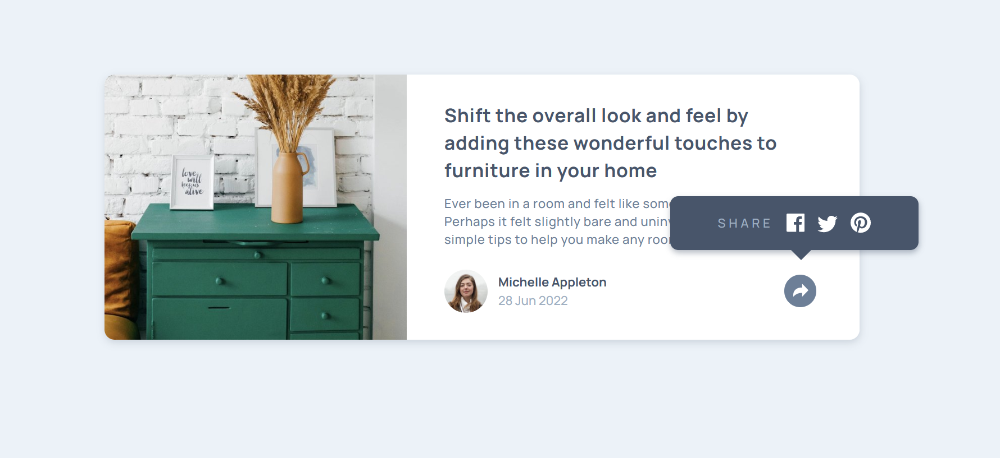
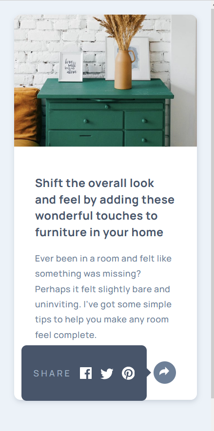

# Frontend Mentor - Article preview component

This is a solution to the [Article preview component challenge on Frontend Mentor](https://www.frontendmentor.io/challenges/article-preview-component-dYBN_pYFT).

## Table of contents

- [Overview](#overview)
  - [The challenge](#the-challenge)
  - [Screenshot](#screenshots-of-my-final-project)
  - [Link](#link)
- [My process](#my-process)
  - [Built with](#built-with)
  - [What I learnt](#what-i-learnt)
  - [Useful resources](#useful-resources)

## Overview

### The challenge

In this challenge, the goal was to create an article card, but with a toggable popup share button.

### Screenshots of my final project

<span>


</span>

### Link

- Live Site URL: [project hosted on Netlify](https://genuine-kelpie-ff4882.netlify.app/)

## My process

In my solution, I employed a mobile-first approach, starting with the design for mobile devices and then progressively enhancing it for larger screens. I created utility classes for fonts, colors, and sizes, and then proceeded to implement the buttons and overall layout.

### Built with

- Semantic HTML5 markup
- CSS custom properties
- Flexbox
- Mobile-first workflow

### What I learnt

Throughout this challenge, I gained experience creating a dynamic pop up button. Starting to get familiar with animations.

```css
.popup .show {
  visibility: visible;
  -webkit-animation: fadeIn 1s;
  animation: fadeIn 1s;
}

```

```js
if (event.target !== shareButton && !popup.contains(event.target)) {
    if (popup.classList.contains("show")) {
      popup.classList.remove("show");
      shareButton.classList.remove("active-button");
    }
  }
```

### Useful resources

- [Create a Design System with CSS](https://www.youtube.com/watch?v=lRaL-8qZ0mM) - This video tutorial provided valuable insights into working with more complex CSS tools. The design system pattern presented in the video was particularly useful and I intend to incorporate it in my future projects.
