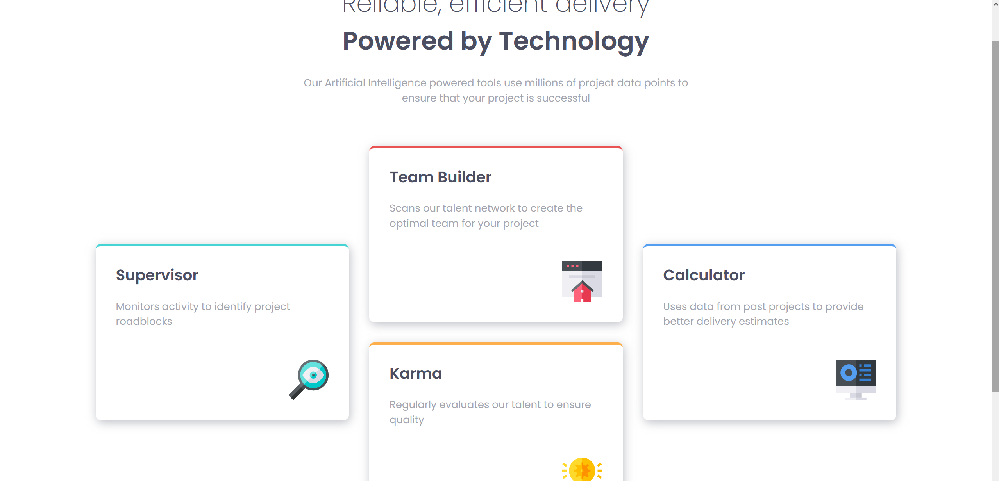
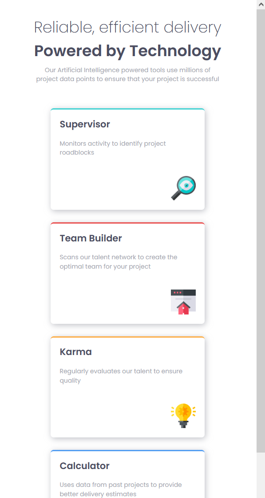

# Frontend Mentor - Four card feature section solution

This is a solution to the [Four card feature section challenge on Frontend Mentor](https://www.frontendmentor.io/challenges/four-card-feature-section-weK1eFYK).

## Table of contents

- [Overview](#overview)
  - [The challenge](#the-challenge)
  - [Screenshot](#screenshots-of-my-final-project)
  - [Link](#link)
- [My process](#my-process)
  - [Built with](#built-with)
  - [What I learnt](#what-i-learnt)
  - [Useful resources](#useful-resources)

## Overview

### The challenge

In this challenge, the goal was to create an Four card feature section that shows users a layout based on their device's screen size.

### Screenshots of my final project

<span>


</span>

## My process

In my solution, I employed a mobile-first approach, starting with the design for mobile devices and then progressively enhancing it for larger screens. I created utility classes for fonts, colors, and sizes, and then proceeded to implement the buttons and overall layout.

### Built with

- Semantic HTML5 markup
- CSS custom properties
- Flexbox
- Mobile-first workflow

### What I learnt

Throughout this challenge, I gained experience creating a responsive desing by using a different layout for each device. I also deepened my understanding of CSS customizations.

```css
.card {
  gap: clamp(0.5rem, 1.5rem, 3rem);
  box-shadow: 2px 4px 15px hsl(var(--clr-grey-blue) / 0.7);
  border-top: 4px solid;
  ...;
}
```

```html
<div class="card text-cyan">
  <h3 class="text-dark-blue fs-600">Supervisor</h3>
  <p>Monitors activity to identify project roadblocks</p>
  
</div>
```

### Useful resources

- [Create a Design System with CSS](https://www.youtube.com/watch?v=lRaL-8qZ0mM) - This video tutorial provided valuable insights into working with more complex CSS tools. The design system pattern presented in the video was particularly useful and I intend to incorporate it in my future projects.
