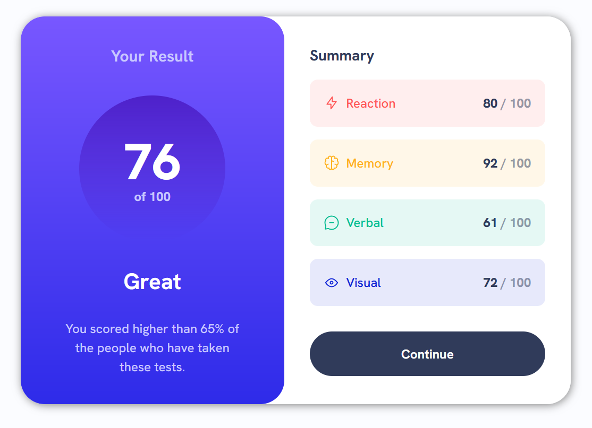
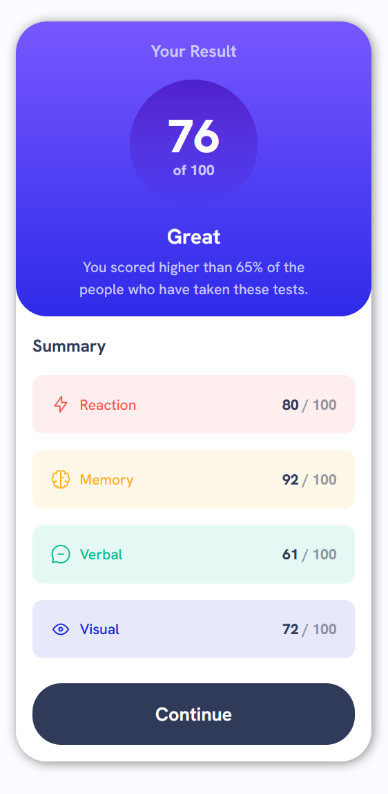

# Frontend Mentor - Results summary component solution

This is a solution to the [Results summary component challenge on Frontend Mentor](https://www.frontendmentor.io/challenges/results-summary-component-CE_K6s0maV).

## Table of contents

- [Overview](#overview)
  - [The challenge](#the-challenge)
  - [Screenshot](#screenshots-of-my-final-project)
  - [Link](#link)
- [My process](#my-process)
  - [Built with](#built-with)
  - [What I learned](#what-i-learned)
  - [Continued development](#continued-development)
  - [Useful resources](#useful-resources)

## Overview

### The challenge

Users should be able to:

- View the optimal layout for the interface depending on their device's screen size
- See hover and focus states for all interactive elements on the page

### Screenshots of my final project

<span>


</span>

### Link

- Live Site URL: [project hosted on Netlify](https://earnest-caramel-359f0e.netlify.app)

## My process

Started with mobile design first. Created the utility classes (fonts, colors, sizes), followed by the buttons and layout.

### Built with

- Semantic HTML5 markup
- CSS custom properties
- Flexbox
- Mobile-first workflow

### What I learned

Wanted to learn more css but at the end of the project i found dom manipulation and selection something i need to improve on, next project maybe using jQuery.

```html
<div class="flex" style="--gap: 0.5rem"></div>
```

```css
.circle {
  border-radius: 50%;
  position: relative;
  z-index: 1;
  display: inline-grid;
  place-items: center;
  ...;
}
```

```js
const percentArray = document.querySelectorAll(
  "div.summary-container > div > p > span"
);
```

### Continued development

Improvement would be to use the json data properly to add more tags dynamically, from changing just the json data only. Currently hardcoded, as a mismatch in json array and div array length will cause issues.

### Useful resources

- [Create a Design System with CSS](https://www.youtube.com/watch?v=lRaL-8qZ0mM) - This helped me for use more complex CSS tools. I really liked this pattern and will use it going forward.
- [X-Content-Type-Options](https://developer.mozilla.org/en-US/docs/Web/HTTP/Headers/X-Content-Type-Options?utm_source=mozilla&utm_medium=firefox-console-errors&utm_campaign=default) - This is an amazing article which helped me finally understand X-Content-Type-Options. I'd recommend it to anyone still learning this concept.
